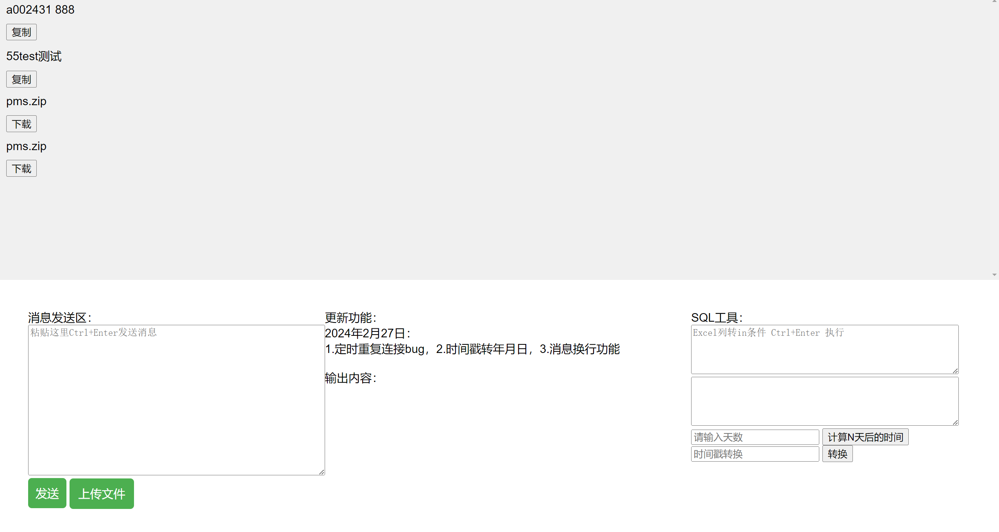

# 本地通信
效果图

## 项目背景
1.公司有一台电脑专门用于处理生产数据的查询报障啥的。
无法访问外网，局域网的linux机器也无法访问-可能防火墙限制，故此需要搭建一个本地通信项目用于实现局域网之间的通信。

## 项目简介
项目运行环境如下：
- nodejs v14.17.0
- win10
- nginx


这个项目实现了以下功能：
- 功能1：局域网之间发送消息。
- 功能2：局域网之间发送文件。
- 功能3：Excel 列数据转 in 条件。
- 功能4：时间戳和日期的转换。

## 如何运行项目

1. 克隆项目到本地
```bash
git clone https://github.com/a329279263/localChats.git

进入项目目录
cd localChats/ws

安装依赖
npm install

运行 webSocket 服务
node server.js
windows下直接运行 start.bat 或者 ws.vbs（后台运行）

nginx配置

location ^~ /chats {
    alias              D:/Project/99/localChats/;
    index  			 index.html index.htm;
    proxy_set_header Host  $host;
    proxy_set_header X-Real-Ip $remote_addr;
    proxy_set_header X-Forwarded-For $proxy_add_x_forwarded_for;
    proxy_set_header X-Nginx-Proxy true;
}

访问项目
在浏览器中访问
http://192.168.2.216/chats/
或
http://localhost/chats/

其他信息
作者：lzh
